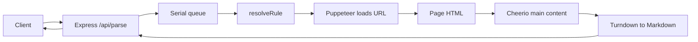

# Project architecture: docker-Scrape-Web-Page-To-Markdown

## Goals

Provide a Mercury Parser–style service: clients send a target **URL**; the backend loads the page in a **headless browser** (including JavaScript rendering), applies **selector-based rules** to extract the main article text, returns **Markdown**, and exposes everything via a **REST API**. The design emphasizes **installing dependencies inside Docker**, **extensible per-domain rules**, and a **single queue** so multiple heavy browser jobs do not run at once.

## Stack

| Layer | Technology |
|-------|------------|
| Runtime | Node.js (inside Docker) |
| HTTP | Express |
| Fetch / render | Puppeteer (Chrome from the base image; see `Dockerfile` env vars) |
| HTML parse / select | Cheerio |
| HTML → Markdown | Turndown |
| Base image | `buildkite/puppeteer` |

## Repository layout

```
repo root/
├── Dockerfile              # npm install --omit=dev in image; node_modules at /node_modules
├── docker-compose.yml      # bind-mount ./app → /app, PORT, command
├── package.json            # dependency manifest (installed at image build; not required on host)
├── startup.sh, logs.sh     # deploy / logs (see README.md)
├── scripts/self-test.sh    # curl-based API smoke test
└── app/
    ├── index.js            # Express app: routes, queue, orchestration
    ├── queue.js            # serial queue + delay between jobs
    ├── scrape.js           # Puppeteer: tab, navigate, return HTML
    ├── extract.js          # rule merge, Cheerio extraction, Turndown
    └── rules/              # rule loader + JSON files
        ├── index.js        # load default.json + *.json → { default, domains }
        ├── default.json
        └── *.json          # one override set per hostname (filename)
```

## Request pipeline (high level)



1. Validate and parse `url` (`http` / `https` only).  
2. Enqueue work: **only one** scrape runs at a time; after each job finishes, wait **1 second** before the next (`queue.js`).  
3. Merge rules for the URL hostname (`resolveRule` in `extract.js`).  
4. `scrape.js` opens a new Puppeteer page, navigates (using `waitUntil`, `timeout`, etc. from the rule), optionally `waitForSelector`.  
5. `extract.js` removes nodes matching `removeSelectors`, then walks `contentSelectors` **in order** and picks the first block whose text length is ≥ `minTextLength`; otherwise falls back to `body`. Title comes from `titleSelector`, or Open Graph, or `<title>`.  
6. Turndown converts the chosen HTML fragment to Markdown (`content`).  
7. Respond with JSON: `url`, `title`, `content`.

## Rule files (`app/rules/`)

- **`default.json`** — full default fields (`waitUntil`, `navigationTimeoutMs`, `waitForSelector`, `minTextLength`, `titleSelector`, `contentSelectors`, `removeSelectors`, etc.).  
- **`{domain}.json`** — only fields you want to override.  
- **Merge semantics** (`resolveRule`):  
  - Scalar / general fields: domain JSON overrides defaults.  
  - **`removeSelectors`**: **concatenated** with defaults (defaults first, then domain-specific removals).  
  - **`contentSelectors`**: if the domain file defines it, that array **replaces** the default `contentSelectors` entirely (no interleaving).  
- **Hostname matching**: strip a leading `www.` and lowercase; match if the host **equals** a rule key or is a **subdomain of** `*.{key}`. Files are read in sorted name order; the first matching key in the iteration order still follows this hostname logic.

Rules load **once** at `require('./rules')` (`rules/index.js`); restart Node / the container after editing JSON.

## Docker and module resolution

- The image copies **`package.json`** to **`/`** and runs **`npm install --omit=dev`**, so **`node_modules` lives at `/node_modules` in the image**.  
- Compose bind-mounts **`./app` to `/app`**; the process starts **`/app/index.js`**. Node resolves packages from `/app/node_modules` up to **`/node_modules`**, so the **host repo does not need `node_modules`**.  
- Puppeteer uses **`PUPPETEER_SKIP_CHROMIUM_DOWNLOAD`** and **`PUPPETEER_EXECUTABLE_PATH`** to run the image’s **Google Chrome** instead of downloading another Chromium.

## Comparison to Mercury Parser (conceptual)

| Aspect | This project |
|--------|----------------|
| Input | URL (GET query or POST JSON) |
| Output | JSON including Markdown body |
| Main content | Maintainable **JSON rule files** + default selector chain |
| Dynamic pages | Puppeteer render, then parse |
| Concurrency | Single queue + cooldown between jobs |

## Related docs

- Operations, API, scripts: [README.md](README.md)  
- Repo conventions (Docker-only deps, `sudo`): `.cursor/skills/docker-no-local-npm/SKILL.md` (if enabled)
